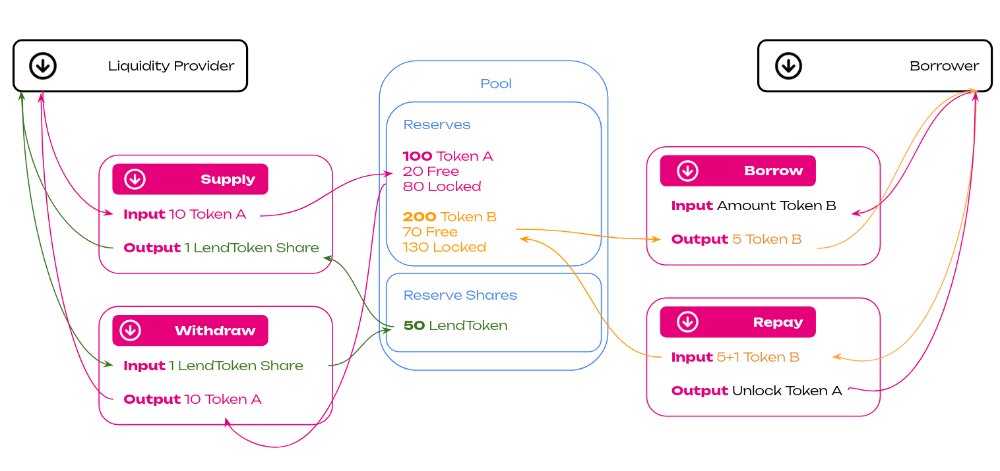

# Kylix Finance - The Hub Lending Parachain
### Kylix Finance is a Collateralized Debt Position (CDP) parachain with an integrated marketplace for bidding on liquidated collateral.

[](https://github.com/davassi/kylix-finance/)
[](https://github.com/rust-secure-code/safety-dance/)
[](https://github.com/dtolnay/no-panic)
[](https://www.repostatus.org/#active)

Kylix is a non-custodial substrate dapp that implements Compound V2-style functionality for lending and borrowing assets across the chain. It allows users to participate as depositors or borrowers, lending and borrowing assets on Polkadot. Borrowers can leverage their assets in an over-collateralised manner, while depositors can provide liquidity and earn interest as a stable passive income.

:warning: It is **not a production-ready substrate node**, but it is still a proof of concept. It is discouraged to use this code 'as-is' in a production runtime.

## User Flow



## How does it work - Supply and Withdrawal

Kylix lets users borrow assets for a fee and lend them for interest. A borrower can instantly get a loan and start investing by providing some collateral. When the collateral falls below a specific value, the borrower must top it up to the required level to avoid liquidation. The collateral is unlocked when the borrower returns the loan plus a fee.

By depositing one of the listed assets, the lender will be able to receive lendTokens and earn lending fee income. lendToken is like a deposit certificate of an underlying asset that accrues interest from being borrowed on Kylix Finance. lendToken is redeemable at any time at a 1-to-1 rate with the underlying asset.

### Liquidation Protection - Borrow and Repay

A collateralized loan gives borrowers more time to use their funds in return for providing collateral. A borrower can provide a variety of crypto to back up their loans. With crypto being volatile, you will likely have a low loan-to-value ratio (LTV), such as 50%, for example. This figure means that your loan will only be half the value of your collateral. This difference provides moving room for the collateral’s value if it decreases. Once your collateral falls below the loan's or some other value, the funds are sold or transferred to the lender.

## Exposed Extrinsics

Kylix Finance currently exposes to the world 9 defined extrinsic:

<details>
<summary><h3>create_lending_pool</h3></summary>

The `create_lending_pool` function allows a user to Create a new reserve and then supply it with some liquidity. Given an asset and its amount, it creates a new lending pool, if it does not already exist, and adds the provided liquidity/ The user will receive LP tokens in return in ratio.

#### Parameters:
* `origin` - The origin caller of this function. This should be signed by the user that creates the lending pool and add some liquidity.
* `id`: AssetIdOf<T> - The pool id, provided by the user
* `asset` - The identifier for the type of asset that the user wants to provide.
* `balance` - The amount of `asset` that the user is providing.
 
#### Errors:

This function will return an error in the following scenarios:

* If the origin is not signed (i.e., the function was not called by a user).
* If the provided assets do not exist.
* If `amount` is 0 or less.
* If adding liquidity to the pool fails for any reason due to arithmetic overflows or underflows

</details>
<details>
<summary><h3>do_supply</h3></summary>

Create a new lending pool. Deposit initial liquidity (in the form of an asset). Create a new liquidity token. Mint & transfer to the caller accounts an amount of the liquidity token equal to `currency_amount`. Emits two events on success: `LiquidityPoolCreated` and `AddedLiquidity`.

#### Parameters:
 * `origin` – Origin for the call. Must be signed.
  * `liquidity_token_id` – ID of the liquidity token to be created. The asset with this ID must *not* exist.
  * `asset_a_id` – ID of the asset A traded on the created liquidity pool. The asset with this ID must exist.
  * `asset_b_id` – ID of the asset B traded on the created liquidity pool. The asset with this ID must exist.
  * `amount_a` – Initial amount of asset A to deposit in the pool. Must be greater than 0.


#### Errors:
* `LiquidityPoolAlreadyExisting` - Trying to recreate an existing liquidity pool
* `LiquidityPoolDoesNotExist` - Trying to add or remove liquidity from/to a non-existing liquidity pool

#### Tests
 * `create_new_liquidity_pool_success_test`
  * `create_the_same_liquidity_pool_twice_fail_test`

</details>

<details>
<summary><h3>do_withdraw</h3></summary>

#### Parameters:

#### Errors:

#### Tests
</details>

<details>
<summary><h3>do_borrow</h3></summary>

#### Parameters:
 
#### Errors:

#### Tests
</details>

<details>
<summary><h3>do_repay</h3></summary>


#### Parameters:
 
#### Errors:

#### Tests
</details>


 

## Getting Started

### Build

Use the following command to build the node without launching it:

```sh
cargo build --release
```

to test with logging, use:

```sh
RUST_LOG=runtime=debug cargo t -- --nocapture
```sh

### Single-Node Development Chain

The following command starts a single-node development chain that doesn't persist state:

```sh
./target/release/node-template --dev
```

To purge the development chain's state, run the following command:

```sh
./target/release/node-template purge-chain --dev
```

To start the development chain with detailed logging, run the following command:

```sh
RUST_BACKTRACE=1 ./target/release/node-template -ldebug --dev
```

### Connect with Polkadot-JS Apps Front-End (TODO)

After you start the node template locally, you can interact with it using the hosted version of the [Polkadot/Substrate Portal](https://polkadot.js.org/apps/#/explorer?rpc=ws://localhost:9944) front-end by connecting to the local node endpoint.
A hosted version is also available on [IPFS (redirect) here](https://dotapps.io/) or [IPNS (direct) here](ipns://dotapps.io/?rpc=ws%3A%2F%2F127.0.0.1%3A9944#/explorer).
You can also find the source code and instructions for hosting your instance on the [polkadot-js/apps](https://github.com/polkadot-js/apps) repository.

### Future Improvements

0. a lot.

## Contribution

Kylix Finance is a work in progress. If you have suggestions for features, or if you find any issues in the code, design, interface, etc, please feel free to share them on our [GitHub](https://github.com/davassi/polkalend-finance/issues).


1. The pitch deck is missing a couple of slides pointed out by @chris.casini (competitors, tokenomics)
2. The whitepaper just started https://typst.app/project/r2X0n4utkuHszwXiEKABOT
3. Mockups and wireframes design are under work from @frateorion https://drive.google.com/drive/folders/1PQ0o80manZsbrESuaVcHQGDyO9OXf3R6
4. Data models/API are defined in the poc, but we need to describe them
5. Overview of the tech stack still need to be written 
6. Documentation of core components, etc still need to be written
7. Poc is under development both from backend substrate and from frontend side