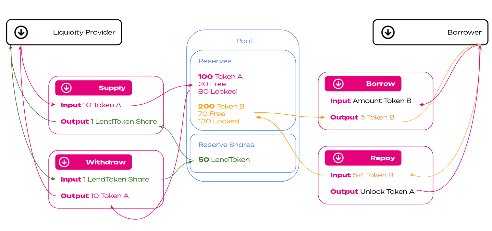
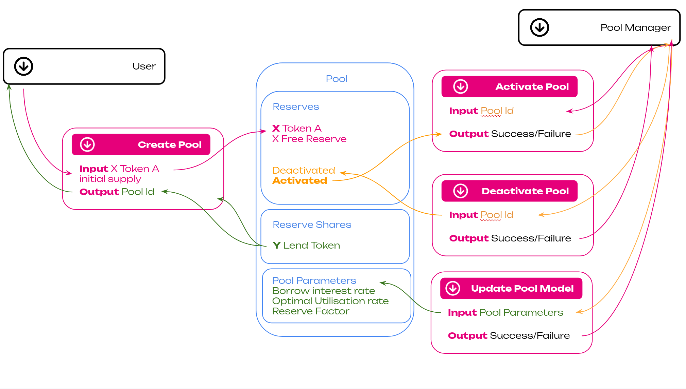

# Kylix Finance - The Hub Lending Parachain

### Kylix Finance is a Collateralized Debt Position (CDP) parachain with an integrated marketplace for bidding on liquidated collateral.

[](https://github.com/davassi/kylix-finance/)
[](https://github.com/rust-secure-code/safety-dance/)
[](https://github.com/dtolnay/no-panic)
[](https://www.repostatus.org/#active)

Kylix is a non-custodial substrate dapp that implements Compound V2-style functionality for lending and borrowing assets across the chain. Users can deposit and borrow assets backed by crypto collaterals for interest, creating Collateralized Debt Positions (CDPs) on the Polkadot ecosystem. Borrowers can leverage their assets in an over-collateralised manner, while depositors can provide liquidity and earn interest as a stable passive income.

:warning: It is **not a production-ready substrate node**, but it is still a proof of concept. It is discouraged to use this code 'as-is' in a production runtime.

 <p align="center">
    <a href="https://github.com/Kylix-Finance/kylix-finance-substrate/issues">Report Bug</a>
    ·
    <a href="https://github.com/Kylix-Finance/kylix-finance-substrate/issues">Request Feature</a>
</p>

## User Flows




## How does it work - Supply and Withdrawal

Kylix lets users borrow assets for a fee and lend them for interest. A borrower can instantly get a loan and start investing by providing some collateral. The need for collateral is necessary because credit rating is irrelevant in the context of blockchain accounts, and repayment cannot be enforced in the event of a loan default or a traditional (in financial terms) non-performing loan (NPL). When the collateral falls below a specific value, the borrower must top it up to the required level to avoid liquidation. The collateral is unlocked when the borrower returns the loan plus a fee.

By depositing one of the listed assets in a lending pool, the lender will be able to receive lendTokens (**kTokens**) and earn lending fee income. kTokens are like a deposit certificate of an underlying asset that accrues interest from being borrowed on Kylix Finance. They are redeemable at any time at a 1-to-1 rate with the underlying asset.

### Liquidation Protection - Borrow and Repay

Loans are over-collateralized with an asset, which may differ from the loaned asset. A borrower can provide a variety of crypto to back up their loans. With crypto being volatile, it is necessary to have a collateral-asset loan-to-value ratio (LTV), such as 75%, on average. This figure means that a loan will only 3/4 the value of your collateral. This difference provides moving room for the collateral’s value if it decreases. Once a collateral falls below the loan's value, the funds are liquidated through an auction mechanism and transferred automatically to the lender.

## Getting Started

### Built with

Kylix Financce project is built with:

- [Rust](https://www.rust-lang.org/)
- [Substrate](https://substrate.dev/)

### Prerequisites

```
curl https://sh.rustup.rs -sSf | sh
```

Please also install the following dependencies:

- `cmake`
- `clang` (>=10.0.0)
- `clang-dev`
- `libc6-dev`
- `libssl-dev`

### Build

Use the following command to build the node without launching it:

```sh
cargo build --release
```

to test with logging, use:

````sh
RUST_LOG=runtime=debug cargo t -- --nocapture
```sh

### Single-Node Development Chain

The following command starts a single-node development chain that doesn't persist state:

```sh
./target/release/kylix-node --dev
````

To purge the development chain's state, run the following command:

```sh
./target/release/kylix-node purge-chain --dev
```

To start the development chain with detailed logging, run the following command:

```sh
RUST_BACKTRACE=1 ./target/release/kylix-node -ldebug --dev
```

### Connect with Polkadot-JS Apps Front-End (TODO)

After you start the kylix node locally, you can interact with it using the hosted version of the [Polkadot/Substrate Portal](https://polkadot.js.org/apps/#/explorer?rpc=ws://localhost:9944) front-end by connecting to the local node endpoint.
A hosted version is also available on [IPFS (redirect) here](https://dotapps.io/) or [IPNS (direct) here](ipns://dotapps.io/?rpc=ws%3A%2F%2F127.0.0.1%3A9944#/explorer).
You can also find the source code and instructions for hosting your instance on the [polkadot-js/apps](https://github.com/polkadot-js/apps) repository.

### Future Improvements

This is a POC of Kylix. The current implementation for Kylix MVP is underway.

## Contribution

Kylix Finance is a work in progress. If you have suggestions for features, or if you find any issues in the code, design, interface, etc, please feel free to share them on our [GitHub](https://github.com/Kylix-Finance/kylix-finance-substrate/issues) or reach us on Discord:

- [Discord](https://discord.gg/QjrYHwTJth)

## License

Kylix Finance is licensed under the terms of the Apache License (Version 2.0). See LICENSE

## Contact

Website: [kylix.financce](https://www.kylix.finance)

Email: [info at kylix.finance](info@kylix.finance)

Discord: [Discord](https://discord.gg/QjrYHwTJth)

Telegram: [Telegram](https://t.me/kylix_finance_parachain)
